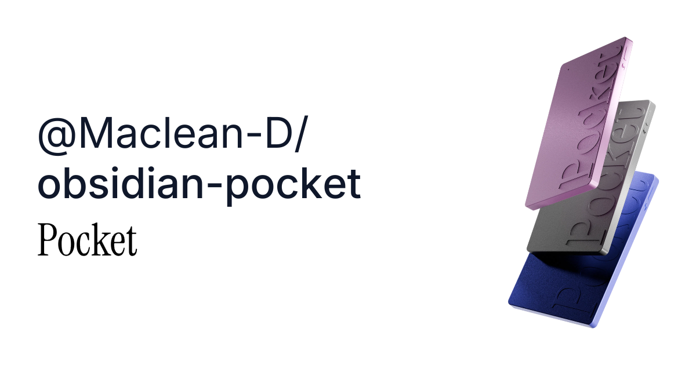

# Pocket Sync for Obsidian

Sync Pocket AI conversations and daily highlights into Markdown notes.

## Features

- Sync conversations, summaries, action items, and transcripts
- Sync daily highlights tagged with `highlights`
- Auto-sync, startup sync, and manual sync
- Custom folders and filename templates
- Writes Pocket metadata as normal Obsidian properties
- Keeps note content in a managed block so you can add your own notes around it

## Setup

1. Generate a Pocket API key at [Pocket API keys](https://app.heypocket.com/app/settings/api-keys)
2. Open **Settings -> Community plugins -> Pocket Sync**
3. Paste your API key
4. Click `Test connection`
5. Click `Sync now` or use the ribbon button

## Default output

- Conversations: `Pocket/Conversations`
- Daily highlights: `Pocket/Daily highlights`
- Conversation filename: `{{date}} {{title}}`
- Daily highlight filename: `{{date}} Daily highlights`

## Notes

- Imported notes contain copies of your Pocket data
- Your API key is stored in local Obsidian plugin data
- No telemetry
- No backend
- No audio downloads

## Star History

## Contributors

